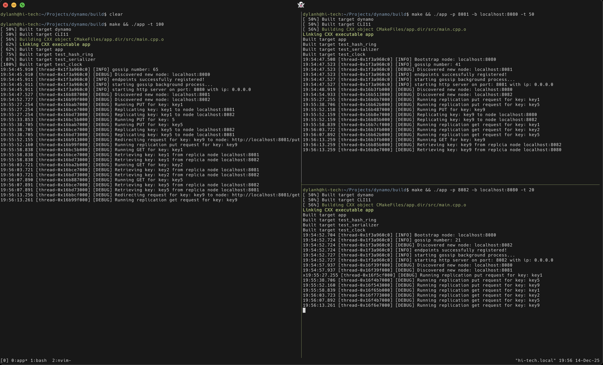
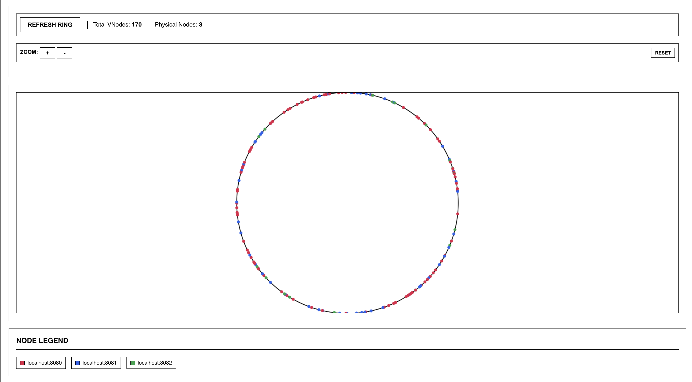

# dynamo

**goal:** a highly available, eventually consistent, low latency kv store. 

nodes running in terminal


webui preview


webui hash ring visualizer


## Web UI

To use the development web UI 
```bash
cd webui && ./serve.sh
```
Then open http://localhost:3000 in your browser.

TODO: 
- [x] Basic in memory storage layer and http connections
    - [] investigate leveldb stalling
- [x] Consistent hashing and partitioning across virtual nodes
- [x] Persistent storage and crash recovery
- [x] Replication
- [x] R/W quorom
- [ ] retry mechanism (?)
- [x] data versioning and vector clocks
    - [ ] verify this works well
- [ ] hinted handoff mechanism
- [ ] anti entropy mechanism
- [x] membership and failure detection
- [x] cool visualizations
- [ ] collect metrics 
